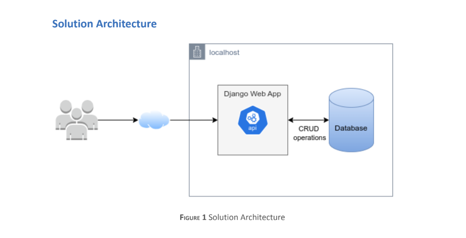

## project_app_django

To create a Django web application for managing a video game catalog with CRUD functionalities, you will follow a structured approach involving several key steps. This guide will walk you through the process, from setting up your development environment to deploying your application. Here's a comprehensive manual on how to proceed:

## Setting Up Your Development Environment
### `Create a GitHub Repository:` 

Start by creating a new project repository on GitHub. This will host your project code and allow for version control.

### `Clone the Repository to Your Local Machine:` 
Use your preferred IDE, such as Visual Studio Code (VSC), to clone the repository to your local machine. This makes it easier to manage your project files.

### `Create a Virtual Environment:`

 In your project directory, create a virtual environment to isolate your project dependencies. Use the command python -m venv env on your terminal. This step ensures that your project dependencies do not conflict with those of other projects on your machine.

### `Activate the Virtual Environment:`
 Activate the virtual environment by running source env/bin/activate (on Unix/macOS) or .\env\Scripts\activate (on Windows). This step is crucial to ensure that all Python packages you install are confined to this environment.

## Installing Django and Starting Your Project
### `Install Django:`
 Within your activated virtual environment, install Django using the command pip install Django. This will install the latest version of Django in your virtual environment.

### `Create a Django Project:`
 Initialize a new Django project by executing django-admin startproject your_project_name. Replace your_project_name with your preferred name for the project.

### `Create a Django App:`
 Create a Django app by running python manage.py startapp your_app_name within your project directory. This app will contain the core functionality of your video game catalog.

## Configuring Your Django Project
### `Database Configuration:`
 Configure your project to use a PostgreSQL database by updating the DATABASES setting in settings.py. You will need to install the psycopg2 package (pip install psycopg2) and specify your database name, user, and password in the configuration.

### `Define Your Game Model:`
 In the models.py file of your app, define a Game model with fields for the game's title, genre, release date, and a brief description. This model represents the structure of your video game catalog.

### `Migrate Your Database:`
 Apply migrations to your database to reflect the models you've defined by running python manage.py migrate.

### `Create an Admin User:`
 Create a superuser for your Django admin site with python manage.py createsuperuser. Follow the prompts to set up your admin username and password.

### `Register Your Models with the Admin Site:`
 In admin.py, import your models and register them with admin.site.register(YourModel) so that you can manage them through the Django admin interface.

## Implementing CRUD Functionalities
### `URL Configuration:`
 Define URLs for your app in urls.py. Map routes to view functions that will handle the creation, retrieval, update, and deletion of video game entries.

### `Views:`
 Implement view functions in views.py that interact with your models and render templates or JSON responses. Use Django's generic views or create your own to handle the logic for each CRUD operation.

### `Templates:`
 Create HTML templates for your app's pages. These templates should include forms for creating and updating game entries, and lists or detail views for displaying them.

## Integrating Django Rest Framework
### `Install Django Rest Framework:`
 Enhance your app with RESTful APIs by installing Django Rest Framework (DRF) using pip install djangorestframework.

### `Configure DRF:`
 Add 'rest_framework' to your INSTALLED_APPS in settings.py. Define serializers in a serializers.py file to convert model instances to JSON and vice versa.

### `API Views:`
 Implement API views in views.py using DRF's generic views or viewsets. Map these views to URLs in your app's urls.py.

### `Testing with Postman:`
 Use Postman to test your API endpoints. Ensure that you can successfully create, retrieve, update, and delete game entries through the API.

## Final Steps
### `Static Files Configuration:`
 Configure your static files settings in settings.py to manage CSS, JavaScript, and image files.

### `Testing:`
 Thoroughly test your application to ensure all functionalities are working as expected. Use Django's testing framework to automate tests for your models, views, and URLs.

### `Deployment:`
 Prepare your application for deployment by setting DEBUG to False in settings.py and configuring your ALLOWED_HOSTS. Choose a deployment platform and follow its specific deployment instructions.

By following these steps, you will have developed a functional web application using Django for managing a video game catalog.

