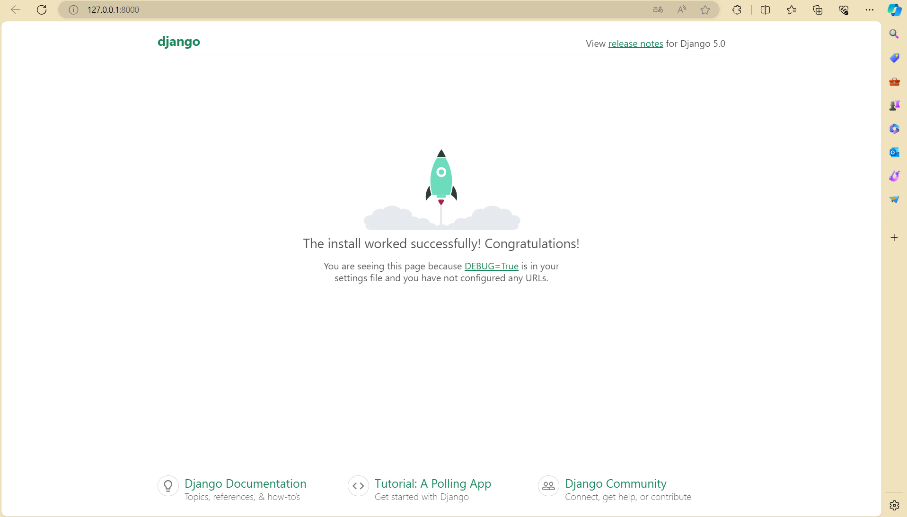
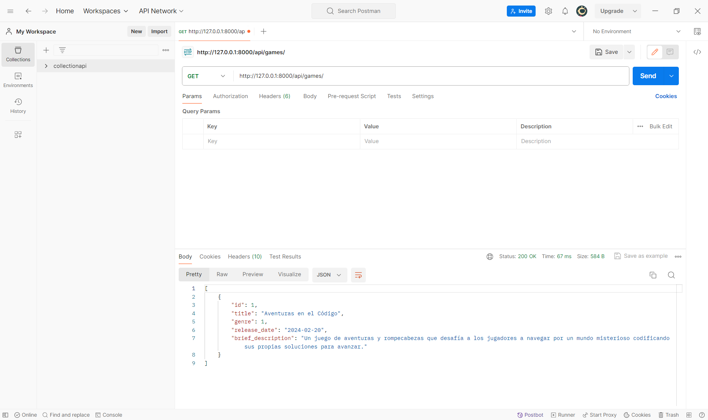

## project_app_django

The architecture consists of the following components:

● Functional Web Application: Develop a Django web application that allows management
of a video game catalog with CRUD functionalities. It should define a Game model in
Django to represent each video game, including fields for the game's title, genre, release
date, and a brief description.

● Database Integration: Integrate the application with a PostgreSQL database, ensuring
efficient data storage and retrieval for game information.


### `creation of a repository`

The first step of our project, if we want to have it in our repository added to our Portfolio, is to create a new project in GitHub, importing the URL of the project to the IDE we want to use, in this case we are going to use VSC.


### `Creation of a virtual environment`

Creating a virtual environment in software development is primarily intended to provide an isolated space where the dependencies of a specific project can be installed and managed without affecting other projects or the underlying operating system. This allows developers to work on multiple projects on the same machine, each with their own versions of packages and libraries, thus avoiding conflicts and compatibility issues between them.


At this point, as shown in the following image, with the command **_source env/bin/activate_**, we access the activation path of the virtual environment.


## Django Framework


Django is a framework for web development in Python, which allows the creation of websites quickly and easily. It provides tools for building secure and scalable websites, managing aspects such as database, application flow, and security automatically. It is popular for its focus on agile development and its ability to handle projects of any size.

### `Django Installation`

Our first step is to install Django in our terminal **_pip install Django_**


At this point, we must have Django correctly installed, so the next step is to create our project in Django with the command **_python -m django startproject project name_**


Continuing with our created Django project, we need to create our application to be developed with the command **_python manage.py startapp application name_**.


If everything is correct, with the command **_python manage.py runserver_** we should get our url localhost from django



## App Django Configurations

We will configure the following essential .py files according to the needs of our application.

### `Settings.py`

```
from pathlib import Path

# Build paths inside the project like this: BASE_DIR / 'subdir'.
BASE_DIR = Path(__file__).resolve().parent.parent


# Quick-start development settings - unsuitable for production
# See https://docs.djangoproject.com/en/5.0/howto/deployment/checklist/

# SECURITY WARNING: keep the secret key used in production secret!
SECRET_KEY = 'django-insecure-mi7l7o0!@dx%a)_x5^h22e7s0vf_8pu*hzt)x9(11q4tt7+#p@'

# SECURITY WARNING: don't run with debug turned on in production!
DEBUG = True

ALLOWED_HOSTS = []


# Application definition

INSTALLED_APPS = [
    'django.contrib.admin',
    'django.contrib.auth',
    'django.contrib.contenttypes',
    'django.contrib.sessions',
    'django.contrib.messages',
    'django.contrib.staticfiles',
    'games',
    'rest_framework',
    'corsheaders',
]

MIDDLEWARE = [
    'django.middleware.security.SecurityMiddleware',
    'django.contrib.sessions.middleware.SessionMiddleware',
    'django.middleware.common.CommonMiddleware',
    'django.middleware.csrf.CsrfViewMiddleware',
    'django.contrib.auth.middleware.AuthenticationMiddleware',
    'django.contrib.messages.middleware.MessageMiddleware',
    'django.middleware.clickjacking.XFrameOptionsMiddleware',
    'corsheaders.middleware.CorsMiddleware',
    'django.middleware.common.CommonMiddleware',
]

ROOT_URLCONF = 'threadinglabs.urls'

TEMPLATES = [
    {
        'BACKEND': 'django.template.backends.django.DjangoTemplates',
        'DIRS': [],
        'APP_DIRS': True,
        'OPTIONS': {
            'context_processors': [
                'django.template.context_processors.debug',
                'django.template.context_processors.request',
                'django.contrib.auth.context_processors.auth',
                'django.contrib.messages.context_processors.messages',
            ],
        },
    },
]

WSGI_APPLICATION = 'threadinglabs.wsgi.application'


# Database
# https://docs.djangoproject.com/en/5.0/ref/settings/#databases

DATABASES = {
    'default': {
        'ENGINE': 'django.db.backends.postgresql',
        'NAME': 'mydatabase',
        'USER': 'myuser',
        'PASSWORD': 'mypassword',
        'HOST': 'localhost', # O la dirección IP de tu servidor de base de datos si es remoto.
        'PORT': '5432', # El puerto predeterminado de PostgreSQL.
    }
}


# Password validation
# https://docs.djangoproject.com/en/5.0/ref/settings/#auth-password-validators

AUTH_PASSWORD_VALIDATORS = [
    {
        'NAME': 'django.contrib.auth.password_validation.UserAttributeSimilarityValidator',
    },
    {
        'NAME': 'django.contrib.auth.password_validation.MinimumLengthValidator',
    },
    {
        'NAME': 'django.contrib.auth.password_validation.CommonPasswordValidator',
    },
    {
        'NAME': 'django.contrib.auth.password_validation.NumericPasswordValidator',
    },
]


# Internationalization
# https://docs.djangoproject.com/en/5.0/topics/i18n/

LANGUAGE_CODE = 'en-us'

TIME_ZONE = 'UTC'

USE_I18N = True

USE_TZ = True


# Static files (CSS, JavaScript, Images)
# https://docs.djangoproject.com/en/5.0/howto/static-files/

STATIC_URL = 'static/'

# Default primary key field type
# https://docs.djangoproject.com/en/5.0/ref/settings/#default-auto-field

DEFAULT_AUTO_FIELD = 'django.db.models.BigAutoField'

CORS_ALLOW_ALL_ORIGINS = True

```

### `Models.py`

```
from django.db import models

class Genre(models.Model):
    name = models.CharField(max_length=100)
    description = models.TextField(blank=True, null=True)

    def __str__(self):
        return self.name

class Game(models.Model):
    title = models.CharField(max_length=200)
    genre = models.ForeignKey(Genre, on_delete=models.CASCADE, related_name='games')
    release_date = models.DateField()
    brief_description = models.TextField()

    def __str__(self):
        return self.title

    class Meta:
        ordering = ['release_date']

```

### `Create and apply migrations`

**_python manage.py migrate_**


### `Create administration superuser`

Creating a superuser in Django means creating a user account that has full control over the website, allowing access to the Django admin panel to manage the site's data. This is a crucial step to be able to manage the content and settings of the application in a secure way.


### `admin.py`

```
from django.contrib import admin
from .models import Game, Genre

admin.site.register(Game)
admin.site.register(Genre)

```
### `views.py`

```
from rest_framework.response import Response
from rest_framework import status
from rest_framework.generics import ListCreateAPIView, RetrieveUpdateDestroyAPIView
from .models import Game
from .serializers import GameSerializer

class GameListCreateAPIView(ListCreateAPIView):
    queryset = Game.objects.all()
    serializer_class = GameSerializer

    def list(self, request, *args, **kwargs):
        queryset = self.get_queryset()
        serializer = self.get_serializer(queryset, many=True)
        return Response(serializer.data)

class GameDetailAPIView(RetrieveUpdateDestroyAPIView):
    queryset = Game.objects.all()
    serializer_class = GameSerializer

    def retrieve(self, request, *args, **kwargs):
        instance = self.get_object()
        serializer = self.get_serializer(instance)
        return Response(serializer.data)

```
### `application urls.py`

The urls.py of an application in Django is used to define the routes specific to that application, i.e. how different pages or functions within the application are accessed. Each application within a Django project can have its own urls.py to manage its own routes.

```
from django.urls import path
from .views import GameListCreateAPIView, GameDetailAPIView

app_name = 'games'  # Namespace de la aplicación

urlpatterns = [
    path('', GameListCreateAPIView.as_view(), name='game_list_api'),  # Ruta para la lista de juegos API
    path('<int:pk>/', GameDetailAPIView.as_view(), name='game_detail_api'),  # Ruta para los detalles de un juego específico API
]

```

### `project urls.py`

On the other hand, the project's urls.py is the file that manages all the project's routes in general. It acts as the gateway for all applications in the project, redirecting requests to the corresponding applications based on the requested URL. The main difference is the scope: the project urls.py manages routes at the project level, while the application urls.py focuses on routes specific to that application.

```
from django.contrib import admin
from django.urls import path, include

urlpatterns = [
    path('admin/', admin.site.urls),
    path('api/games/', include('games.urls')),  # Incluye las URLs de la aplicación games API
]

```
## Templates creation

In Django, creating templates.html refers to the process of designing HTML templates that Django will use to generate web pages. These templates define the structure and layout of the pages, allowing data to be inserted and displayed dynamically. Templates.html are stored in a specific folder within each application and can inherit styles and structures from other templates to maintain a consistent design throughout the website. This template system facilitates the separation of the design (HTML) from the programming logic, making development more organized and efficient.

### `game_list.html`

```
<!DOCTYPE html>
<html>
<head>
    <title>Lista de Juegos</title>
</head>
<body>
    <h1>Lista de Juegos</h1>
    <ul>
        
            <li>
                <a href="">{{ game.title }}</a> - {{ game.genre.name }}
            </li>
        
    </ul>
</body>
</html>

```
### `game_details.html`

```
<!DOCTYPE html>
<html>
<head>
    <title>{{ game.title }}</title>
</head>
<body>
    <h1>{{ game.title }}</h1>
    <p><strong>Género:</strong> {{ game.genre.name }}</p>
    <p><strong>Fecha de lanzamiento:</strong> {{ game.release_date }}</p>
    <p><strong>Descripción:</strong> {{ game.brief_description }}</p>
    <a href="">Volver a la lista de juegos</a>
</body>
</html>

```

In this project, the type of database we are going to use is posgreSQL, which is characterized by a robust and efficient database. The following slides show the web page where to follow the installation instructions for Ubuntu


and the creation of the database in terminal.


**_psycopg2_** is a Python library that allows the connection between the Python programming language and the PostgreSQL database. It is essential for projects that use PostgreSQL as their database management system, as it facilitates the execution of SQL queries, the management of database information, and the integration of this information with applications developed in Python.


## Django Rest Framework

Django Rest Framework (DRF) is a powerful tool for building web APIs in the Django ecosystem. It facilitates rapid development of robust APIs, offering a set of out-of-the-box features such as data serialization, authentication, and permissions.

### `Django Rest Framework Installation`

**_pip install djangorestframework_**


Once Django Rest Framework is installed, setting up the **_serializers.py_**, **_views.py_**, and **_urls.py_** files is crucial for your API to work:

### `serializers.py`

```
from rest_framework import serializers
from .models import Game

class GameSerializer(serializers.ModelSerializer):
    class Meta:
        model = Game
        fields = ['id', 'title', 'genre', 'release_date', 'brief_description']

```
### `views.py`


### `urls.py`


## Postman Visualization

Postman is a popular tool used for developing and testing APIs (application programming interfaces). It allows developers to send HTTP requests to web APIs and receive responses, facilitating experimentation, debugging, and testing of APIs.




